# Video → AI-Ready Dataset

Turn an uploaded video into a self-describing, AI-ready dataset — transcript,
representative frames, and a `manifest.json` an LLM can read to understand the
whole bundle without opening anything else. **Adaptive frame selection** is
the flagship extraction mode: it aims for a small, representative set of
frames (30-150) rather than exhaustively dumping every frame, because the
dataset is meant to fit inside a model's context window.

## Prerequisites

- [Docker](https://docs.docker.com/get-docker/) and Docker Compose v2
- ~4GB free disk for Docker images (faster-whisper + PySceneDetect/OpenCV pull
  in a fair amount of Python tooling) plus space for job artifacts
- No GPU required — transcription runs on CPU by default

## One-command startup

```bash
cp .env.example .env
docker compose up --build
```

- Frontend: http://localhost:3000
- API: http://localhost:8000 (docs at http://localhost:8000/docs)

Upload a video, pick an extraction mode (adaptive is selected by default),
watch live progress, and download the resulting `.zip` once it completes.

The first transcription job downloads the faster-whisper model weights (small
by default) and caches them inside the `worker` container; subsequent jobs
reuse the cached model.

## Architecture

```mermaid
flowchart LR
    subgraph Browser
        UI[Next.js frontend]
    end

    subgraph API_Container[api container]
        API[FastAPI]
    end

    subgraph Worker_Container[worker container]
        Celery[Celery worker + embedded beat]
        Pipeline[Pipeline steps: probe → transcribe →\nextract frames → metadata → zip]
    end

    Redis[(Redis\nbroker + result backend)]
    DB[(SQLite\njobs.db)]
    FS[(Local filesystem\n/data/jobs/&#123;job_id&#125;)]

    UI -- REST + SSE --> API
    API -- enqueue job --> Redis
    Redis -- deliver task --> Celery
    Celery --> Pipeline
    Pipeline -- ffmpeg / ffprobe / faster-whisper / PySceneDetect --> FS
    API -- read/write --> DB
    Celery -- read/write --> DB
    API -- serve frames/transcript/zip --> FS
```



### Services (`docker-compose.yml`)

| Service    | Role |
|------------|------|
| `frontend` | Next.js App Router UI |
| `api`      | FastAPI — accepts uploads, exposes job status/SSE/downloads, never blocks on processing |
| `worker`   | Celery worker running the pipeline, with an embedded beat scheduler for retention cleanup and stale-job reaping |
| `redis`    | Celery broker + result backend |

SQLite (`/data/db/app.db`) and job artifacts (`/data/jobs/{job_id}/...`) live
on a shared Docker volume mounted into both `api` and `worker`. The schema
uses plain SQLAlchemy types (no SQLite-specific features) so swapping
`DATABASE_URL` to Postgres later is a connection-string change, not a rewrite.

## How a job flows

```
queued → probing → transcribing → extracting_frames → generating_metadata → zipping → completed
                                                                                      ↘ failed / cancelled (from any state)
```

Each step reports 0-100% progress; the API streams updates over Server-Sent
Events (`GET /api/jobs/{id}/events`) with a polling fallback
(`GET /api/jobs/{id}` on an interval). A Celery beat task periodically checks
for jobs whose heartbeat has gone stale (e.g. the worker crashed mid-job) and
marks them `failed` with a clear reason — nothing is left "processing
forever".

### Output layout

```
{job_id}/
  source/video.<ext>
  transcript/transcript.txt
  transcript/transcript.json
  transcript/subtitles.srt
  frames/0000.000.jpg ...
  metadata/frames.json
  manifest.json
  output.zip
```

`manifest.json` is the entry point for AI consumption: job id, original
filename, video properties, detected language, extraction mode + params,
frame count, every file with a relative path + description, processing
timestamps, app version, and a reserved `analyses` section for future
per-frame/per-transcript analysis outputs (OCR, object detection, embeddings,
etc.) — see [Extending the pipeline](#extending-the-pipeline).

## API

All responses are JSON. Errors use a consistent envelope:

```json
{ "error": { "code": "not_found", "message": "Job ... not found", "detail": null } }
```

| Method | Path | Description |
|---|---|---|
| POST | `/api/jobs` | Multipart upload + options (`mode`, `interval_ms`, `target_frames`, `frame_format`, `frame_max_dim`). Returns `{ job_id }` (202) immediately. |
| GET | `/api/jobs` | Paginated recent jobs |
| GET | `/api/jobs/{id}` | Full job status + per-step progress + error detail |
| GET | `/api/jobs/{id}/events` | SSE progress stream |
| GET | `/api/jobs/{id}/transcript?format=txt\|json\|srt` | Transcript in the requested format |
| GET | `/api/jobs/{id}/frames` | Paginated frame list with thumbnail URLs |
| GET | `/api/jobs/{id}/frames/{filename}` | Serve one frame image |
| GET | `/api/jobs/{id}/manifest` | Raw `manifest.json` |
| GET | `/api/jobs/{id}/logs?since_id=` | Persisted per-job log lines (used by the Processing view) |
| GET | `/api/jobs/{id}/video` | Source video with HTTP Range support, for the Results view's transcript-linked preview player |
| GET | `/api/jobs/{id}/download?asset=zip\|transcript\|frames` | Download the full dataset or a subset |
| DELETE | `/api/jobs/{id}` | Cancel if running (revokes the Celery task) and delete all artifacts |

### Extraction modes

| Mode | Behavior |
|---|---|
| `adaptive` (default) | PySceneDetect content-aware scene detection targeting 30-150 frames (`target_frames`). Too few scenes → falls back to interval sampling to hit the minimum. Too many → keeps the highest-content-change scenes. |
| `interval` | One frame every `interval_ms` (min 100ms) |
| `per_second` | One frame per second |
| `every_frame` | Every decoded frame, hard-capped at `MAX_FRAMES` (default 2000). Videos that would exceed the cap are rejected with a message suggesting `adaptive` instead — the job fails cleanly rather than the worker choking on it. |

## Environment variables

See `.env.example` for the full annotated list. Highlights:

| Variable | Default | Notes |
|---|---|---|
| `MAX_UPLOAD_MB` | 2048 | Upload size cap; enforced during the streamed write, not after buffering the whole file |
| `MIN_FREE_DISK_MB` | 2048 | Uploads are rejected up front if free disk would drop below this after accepting the file |
| `WHISPER_MODEL_SIZE` | small | faster-whisper model; CPU-only unless `WHISPER_DEVICE=cuda` |
| `ENABLE_DIARIZATION` | false | See [Diarization](#optional-speaker-diarization) below |
| `MAX_FRAMES` | 2000 | Hard cap for `every_frame`; soft cap (with a warning) for other modes |
| `ADAPTIVE_MIN_FRAMES` / `ADAPTIVE_MAX_FRAMES` | 30 / 150 | Bounds for adaptive mode's target frame count |
| `RETENTION_HOURS` | 72 | Jobs + artifacts are deleted this many hours after completion by a periodic Celery task |
| `STALE_JOB_TIMEOUT_MINUTES` | 30 | A job with no heartbeat update for this long is marked `failed` (worker crash recovery) |
| `CORS_ORIGINS` | http://localhost:3000 | Comma-separated list |

### Optional speaker diarization

`ENABLE_DIARIZATION=true` turns on a WhisperX-based diarization pass that
adds a `speaker` field to each transcript segment. It's off by default because
it needs extra heavyweight setup not installed by default:

1. Install `whisperx` and `torch` in the worker image (`pip install whisperx`;
   this pulls in `pyannote.audio` and a real PyTorch build).
2. Accept the pyannote model terms on HuggingFace and set `HF_TOKEN` to an
   access token with read access.
3. Rebuild the worker image and set `ENABLE_DIARIZATION=true` in `.env`.

If the flag is on but `whisperx` isn't installed, the step logs a warning and
falls back to a transcript without speaker labels rather than failing the job.

## Extending the pipeline

Processing is an ordered list of `PipelineStep` subclasses
(`backend/app/pipeline/base.py`), each declaring what it `consumes`/`produces`
from a shared context and reporting its own progress:

```python
class MyStep(PipelineStep):
    name = "my_step"          # must be added to PIPELINE_STEPS in app/models.py
    label = "My step"
    consumes = ("frames",)
    produces = ("my_analysis",)

    def run(self, ctx: PipelineContext) -> None:
        frames = ctx.shared["frames"]
        ctx.set_step_progress(self.name, 0)
        # ... do work, call ctx.storage.save_bytes(...) for outputs ...
        ctx.shared["my_analysis"] = {...}
        ctx.set_step_progress(self.name, 100)
```

To wire it in:

1. Add `"my_step"` to `PIPELINE_STEPS` in `backend/app/models.py` (controls
   valid job status values and overall-progress weighting).
2. Add an instance to the list built in `_build_pipeline()` in
   `backend/app/pipeline/runner.py`, in the position it belongs.
3. If it should show up in `manifest.json`, write its results under
   `manifest["analyses"][...]` in `GenerateMetadataStep` (or append your own
   step after it that does so) — that key is reserved exactly for this.
4. Add the step name/label to `PIPELINE_STEP_ORDER` in
   `frontend/lib/types.ts` so the Processing view's step indicator shows it.

This is the intended path for OCR on frames, object detection, scene
classification, LLM summaries, auto-tagging, embeddings + semantic search,
duplicate-frame removal, and keyword extraction — none of which are built in
v1, but the pipeline is shaped so adding them doesn't require touching the API
or frontend beyond the manifest/step-label wiring above.

## Regenerating frontend types from the API

`frontend/lib/types.ts` is hand-maintained to mirror
`backend/app/schemas.py` so the frontend builds without the API running. To
regenerate a fully derived version once the API is up:

```bash
cd frontend
API_BASE_URL=http://localhost:8000 npm run generate-types
```

This writes `frontend/lib/openapi-types.ts` from the live OpenAPI schema.

## Tests

```bash
cd backend
python -m venv .venv && source .venv/bin/activate
pip install -r requirements-dev.txt
pytest
```

- Unit tests mock ffmpeg/faster-whisper and cover each pipeline step in
  isolation, the "no audio track → skip transcription" path, and the
  `every_frame` over-cap rejection.
- `tests/test_integration_pipeline.py` runs the *real* pipeline (real ffmpeg,
  real PySceneDetect, real faster-whisper `tiny` model) against a synthetic
  5-second sample video generated by `backend/scripts/generate_sample.py`. It
  skips automatically if `ffmpeg` isn't on `PATH` or the model can't be
  downloaded (no network) — those are environment constraints, not test
  failures.

## Non-goals (v1)

No auth/accounts, no cloud storage, no GPU requirement, no video editing, no
multi-tenancy, no billing.
