# Video → AI-Ready Dataset

Turn an uploaded video into a self-describing, AI-ready dataset — transcript,
representative frames, and a `manifest.json` an LLM can read to understand the
whole bundle without opening anything else. **Adaptive frame selection** is
the flagship extraction mode: it aims for a small, representative set of
frames (30-150) rather than exhaustively dumping every frame, because the
dataset is meant to fit inside a model's context window.

## Prerequisites

- [Docker](https://docs.docker.com/get-docker/) and Docker Compose v2
- ~4GB free disk for Docker images (faster-whisper + PySceneDetect/OpenCV pull
  in a fair amount of Python tooling) plus space for job artifacts
- No GPU required — transcription runs on CPU by default

## One-command startup

```bash
cp .env.example .env
docker compose up --build
```

- Frontend: http://localhost:3000
- API: http://localhost:8000 (docs at http://localhost:8000/docs)

Upload a video, pick an extraction mode (adaptive is selected by default),
watch live progress, and download the resulting `.zip` once it completes.

The first transcription job downloads the faster-whisper model weights (small
by default) and caches them inside the `worker` container; subsequent jobs
reuse the cached model.

## Architecture

```mermaid
flowchart LR
    subgraph Browser
        UI[Next.js frontend]
    end

    subgraph API_Container[api container]
        API[FastAPI]
    end

    subgraph Worker_Container[worker container]
        Celery[Celery worker + embedded beat]
        Pipeline[Pipeline steps: probe → transcribe →\nextract frames → metadata → zip]
    end

    Redis[(Redis\nbroker + result backend)]
    DB[(SQLite\njobs.db)]
    FS[(Local filesystem\n/data/jobs/&#123;job_id&#125;)]

    UI -- REST + SSE --> API
    API -- enqueue job --> Redis
    Redis -- deliver task --> Celery
    Celery --> Pipeline
    Pipeline -- ffmpeg / ffprobe / faster-whisper / PySceneDetect --> FS
    API -- read/write --> DB
    Celery -- read/write --> DB
    API -- serve frames/transcript/zip --> FS
```



### Services (`docker-compose.yml`)

| Service    | Role |
|------------|------|
| `frontend` | Next.js App Router UI |
| `api`      | FastAPI — accepts uploads, exposes job status/SSE/downloads, never blocks on processing |
| `worker`   | Celery worker running the pipeline, with an embedded beat scheduler for retention cleanup and stale-job reaping |
| `redis`    | Celery broker + result backend |

SQLite (`/data/db/app.db`) and job artifacts (`/data/jobs/{job_id}/...`) live
on a shared Docker volume mounted into both `api` and `worker`. The schema
uses plain SQLAlchemy types (no SQLite-specific features) so swapping
`DATABASE_URL` to Postgres later is a connection-string change, not a rewrite.

## How a job flows

```
queued → fetching_source → probing → loading_model → transcribing → extracting_frames → generating_metadata → zipping → completed
                                                                                                             ↘ failed / cancelled (from any state)
```

`fetching_source` is a fast no-op for a plain file upload (the file's already on
disk). For a pasted URL, this is where [URL ingestion](#url-ingestion-youtube-tiktok-instagram)
happens — metadata + video + comments via yt-dlp — before the rest of the
pipeline runs exactly as it would for an uploaded file.

Each step reports 0-100% progress; the API streams updates over Server-Sent
Events (`GET /api/jobs/{id}/events`) with a polling fallback
(`GET /api/jobs/{id}` on an interval). A Celery beat task periodically checks
for jobs whose heartbeat has gone stale (e.g. the worker crashed mid-job) and
marks them `failed` with a clear reason — nothing is left "processing
forever".

### Transcription reliability

Transcription is the slowest and most memory-hungry step, so it has dedicated
safeguards:

- **`loading_model` is its own step.** The first run downloads ~460MB of
  Whisper weights (`small`). Folding that into "Transcribing audio" made a
  multi-minute download indistinguishable from a hang; now it has its own
  status, progress bar, and log lines.
- **The model cache is a named Docker volume** (`whisper_cache` →
  `/root/.cache/huggingface`). It survives `up --build` and `down`, so the
  download is a one-time cost — only `down -v` forces a re-download. Set
  `PREFETCH_WHISPER_MODEL=true` as a build arg to bake the weights into the
  image instead (offline-safe, ~460MB larger image).
- **The model is loaded once per worker and reused** across sequential jobs;
  the job log says explicitly whether it was loaded or reused.
- **Three layers of timeout**: `WHISPER_MODEL_LOAD_TIMEOUT_SECONDS` and
  `WHISPER_TIMEOUT_SECONDS` bound the two phases with typed failures,
  `HF_HUB_DOWNLOAD_TIMEOUT` bounds a stalled download socket, and Celery's
  `TASK_HARD_TIME_LIMIT_SECONDS` kills the child as a last resort. Nothing
  can hang indefinitely.
- **Progress advances per transcript segment** and a background heartbeat
  refreshes `last_heartbeat` during blocking calls, so the reaper can tell
  "slow" from "dead" and never fails a job that's actually working.
- **`TRANSCRIPTION_CONCURRENCY` defaults to 1.** Each concurrent transcription
  holds its own model copy; two at once on a memory-capped Docker Desktop can
  be OOM-killed, which strands a job in `transcribing`. Jobs queue instead,
  and the Processing view shows **"Waiting in queue — N jobs ahead"** so a
  waiting job never looks frozen. Raise the value if you have RAM headroom.
- **Abnormal worker deaths are explained, not silent.** A child killed by the
  OOM killer fails its job with `worker_out_of_memory` and a message naming
  the knobs to turn, instead of leaving the row untouched.
- **Interrupted jobs recover at startup.** On worker boot, jobs left in a
  running state are requeued (if the source is still on disk) or marked
  `failed` with `error_code: "interrupted"` — controlled by
  `STARTUP_RECOVERY_MODE`.

*Future optimization (not implemented):* a shared-model multithreaded worker
that serves one model instance to N threads would allow real parallelism
without N× memory. Deferred deliberately — the per-process model with
concurrency 1 is the stable configuration.

### Output layout (dataset schema v2)

```
{job_id}/
  source/video.<ext>
  transcript/transcript.txt
  transcript/transcript.json
  transcript/subtitles.srt
  frames/0000.000.jpg ...           # adaptive frames (flat, unchanged from v1)
  frames/opening_dense/...          # every 0.25s of the first 8s (configurable)
  frames/key_events/...             # ±0.25s around each annotated event
  metadata/frames.json              # all frames w/ category, event_id, phash, transcript link
  analytics/performance.json        # engagement metrics + rates, each w/ status/source
  content/caption.txt               # exact post caption (URL jobs)
  content/audio.json                # word counts, overall vs narration WPM, silence gaps, music
  comments/top_comments.json        # full comment objects (id/author/likes/replies/pinned)
  comments/extraction_status.json   # WHY comments are (or aren't) there
  performance/comments.json         # legacy v1 shape, kept for backward compat
  events.json                       # manual-first timeline events (hook, twists, CTA...)
  manifest.json                     # dataset_schema_version: "2.2"
  output.zip
```

`manifest.json` is the entry point for AI consumption: job id, original
filename, video properties, detected language, extraction mode + params,
per-category frame counts, `source_video_sha256`, an `extraction_report`
(status + timing per stage), a `posting_context` block, a machine-readable
`analysis_summary` for cross-video comparison, every file with a relative
path + description, and a reserved `analyses` section for future AI outputs
(OCR, object detection, embeddings) — see
[Extending the pipeline](#extending-the-pipeline).

**The dataset never fabricates data.** Any metric that can't be extracted is
stored as `null` with an explicit status and reason, using this vocabulary:
`success · calculated · partial · not_available · unsupported ·
authentication_required · rate_limited · extraction_failed ·
unexpected_empty_result · manual_required · manual_unavailable ·
no_comments · comments_disabled · skipped · unknown`. `not_available` means
the platform genuinely doesn't have the metric (e.g. Instagram share counts);
`extraction_failed` means it exists but couldn't be read;
`unexpected_empty_result` means the platform reports N>0 but extraction
returned 0 (auth/rate-limit); `unsupported` means the current yt-dlp
extractor doesn't do that job (TikTok comment text); `no_comments` /
`comments_disabled` distinguish real emptiness from a fetch failure;
`calculated` marks values derived from other extracted values (rates);
`manual_required` means only the creator's own analytics can supply it —
those fields are filled via the enrichment flow (coming in the next round) or
manual entry. Every metric also carries a `precision` field (`exact`,
`rounded`, `estimated`, `screenshot_estimated`, `unknown`) so downstream
consumers can weigh comparisons correctly; yt-dlp values default to `exact`.
A v1 dataset (no `dataset_schema_version`) is still fully readable; every
v2 field is additive.

Old datasets: v1 job folders and ZIPs remain valid — all v1 files keep their
paths and shapes, and v2 files simply won't exist there. Consumers should
treat a missing `dataset_schema_version` as `1.0`.

### Schema v2.1 additions (round 1.5)

- `identity`: `{dataset_id, platform, platform_post_id, canonical_url,
  source_url_original, source_video_sha256, exported_at}`. Canonical URLs
  strip tracking params (`?is_from_webapp=1`, `?igsh=…`, `?si=…`) but keep
  the identifying path bits; `platform_post_id` is the extracted native
  ID (TikTok video id, Instagram shortcode, YouTube video id).
- `performance_snapshot`: `{fetched_at, metric_window, source, platform}`.
  Records **when** the metrics were retrieved so a dataset regenerated
  next week is distinguishable from an earlier capture of the same video.
- `platform_capabilities`: per-platform record of what the *current
  extractor* can retrieve (e.g. `tiktok.public_comment_text: false`,
  `instagram.public_views: false`). Describes our extractor, not the
  platform itself.
- Frame `mode` and `category` enums are now enforced. Adaptive frames use
  `mode: "adaptive"`, dense-opening frames use `mode: "dense_interval"`,
  key-event frames use `mode: "key_event"` — the R1 contradiction where
  dense frames had `mode: "adaptive"` is fixed. Valid combinations live
  in `app/utils/frame_schema.py`.
- Audio fields renamed for precision: `voiceover_span_seconds` (first
  spoken word → last spoken word), `active_narration_seconds` (sum of
  segment spans), `silence_or_render_wait_seconds` (span − narration),
  `overall_video_wpm`, `active_narration_wpm`. Old names
  (`voiceover_duration_seconds`, `overall_wpm`) preserved as deprecated
  aliases with a `_deprecated` note pointing to the new names.
- `extraction_params.opening_dense` and `.key_events` record the
  **effective** values used, with a `source` label
  (`default_configuration` / `user_interface`). No more `null` for a
  value the pipeline actually used.
- `total_frame_count` + `frame_count_legacy_meaning: "adaptive_frames_only"`
  disambiguate the `frame_count` legacy field.
- Every metric carries a `precision` field. yt-dlp values default to
  `exact`; rates get `precision: "derived_from_<worst-input>"` (no fake
  six-decimal precision when an input is only known as a rounded number).
- Every rate also carries `numerator_field` + `denominator_field`
  references and `status: "calculated"`.
- `metadata/validation_report.json` records the pre-export validator's
  status (`success` / `warning` / `error`), warnings list, errors list,
  and `validated_at`. Validation is report-only (the dataset still ships)
  but a dataset with any finding never reports a clean `success`.

### Schema v2.2 additions (round 1 stabilization)

**Canonical dense configuration.** `extraction_params.opening_dense`
(`{enabled, duration_seconds, interval_seconds, source}`) is the canonical
record of the dense-opening extraction that actually ran. The flat keys
`opening_dense_enabled` / `opening_dense_duration` / `opening_dense_interval`
are **deprecated**: they are still written for v1 readers, but always
back-filled from the canonical block, so they can never be `null` while
dense extraction is enabled and never disagree with it. An
`extraction_params._deprecated` map documents each one.

**Per-frame descriptions.** Every entry in `metadata/frames.json` (and the
matching `files[]` entry in the manifest) carries a `description` generated
from the frame's *own* metadata — mode, category, timestamp,
extraction_reason — via one shared helper (`app/utils/frame_schema.py:
describe_frame`), e.g. `Extracted opening-dense frame at t=2.25s using
dense interval mode.` A dense frame can no longer be described as adaptive;
the validator recomputes the same string and flags any disagreement.

**Timestamp policy.** All generated processing timestamps are ISO 8601 with
an explicit UTC offset (`2026-07-26T10:00:19.668895+00:00`), produced by the
single shared utility `app/utils/timestamps.py`. Naive timestamps found in
older datasets are normalized (assumed UTC) with a compatibility warning —
they never prevent a dataset from loading.

**Posting-date precision.** A calendar date is not an exact timestamp.
`posting_context.posted_at` is now `{value, status, source, entry_method,
precision, timezone}` with temporal precision from `exact_datetime · minute
· hour · date_only · month_only · unknown` (yt-dlp upload dates are
`date_only`, timezone `null`). When a more precise value is supplied later,
`upgrade_posted_at` accepts it only if strictly finer and preserves the
superseded record under `posted_at.provenance` — original provenance is
never lost.

**Source vs entry method.** `source` now means true provenance — `yt_dlp`
(scraped from the platform), `user` (a person supplied it), `computed`
(derived from other extracted data; e.g. all audio stats) — and the new
`entry_method` (`automatic` / `manual`) records how it got into the
dataset. The old `source: "auto"` label is deprecated: legacy datasets map
`auto → yt_dlp/computed + automatic` and `manual → user + manual` at read
time. `performance.fields_from` intentionally keeps its `auto`/`manual`
values — it is a stable UI contract.

**Silence analysis.** `content/audio.json` gains a `silence_analysis` block
that makes every number's scope explicit: `total_non_narration_seconds`
(scope `all_gaps_within_voiceover_span` — every non-speaking second between
the first and last spoken word), and `listed_periods` (scope
`full_video_gaps_over_threshold` — gaps ≥ the declared
`listed_periods_minimum_duration_seconds`, including lead-in and tail),
each with `duration_seconds`, plus `listed_periods_total_seconds`. The two
totals measure different things and now say so; the legacy
`silence_or_render_wait_seconds` / `silence_periods` keys remain as
deprecated aliases that always mirror the canonical values.

**Migration behavior.** `app/utils/manifest_compat.py` is the single home
for reading older datasets: `detect_schema_version` (missing → 1.0),
`normalize_manifest` (synthesizes the nested dense block from flat keys,
upgrades `posted_at`, normalizes naive timestamps — always in memory, with
warnings), and `normalize_frames` (backfills category/description on v1
frame lists). Old ZIPs and job folders are **never modified**; v1, v2.0,
and v2.1 datasets all remain loadable.

**Validation codes.** The validator emits stable codes. Structural
contradictions are *errors* on freshly generated (≥2.2) datasets and
*warnings* on legacy ones — either way the result is never `success`:

| Code | Meaning |
|---|---|
| `dense_config_null` | dense enabled but duration/interval null (always an error) |
| `dense_legacy_canonical_mismatch` | flat dense keys disagree with the canonical block |
| `dense_config_missing` | flat keys present but canonical block absent |
| `frame_description_mismatch` | a description disagrees with the frame's metadata |
| `dense_frame_described_as_adaptive` | the original R1 description bug |
| `incompatible_mode_category` / `invalid_frame_mode` / `invalid_frame_category` | frame enum violations |
| `frame_count_mismatch` | declared counts vs files on disk |
| `frame_category_count_mismatch` | declared counts vs frame metadata |
| `total_frame_count_mismatch` | total vs per-category sum |
| `naive_timestamp` | a generated stamp without a UTC offset |
| `posted_at_missing_precision` / `invalid_temporal_precision` / `posted_at_precision_value_mismatch` | posting-date precision issues |
| `silence_totals_ambiguous` | legacy silence keys with no scoped analysis block |
| `silence_listed_total_mismatch` / `silence_period_below_threshold` | listed periods don't reconcile |
| `deprecated_field_mismatch` | a deprecated alias contradicts its canonical replacement |
| `deprecated_source_label` | `source: "auto"` written by a ≥2.2 dataset |
| `invalid_entry_method` / `invalid_status` / `invalid_precision` / `silent_zero` | vocabulary violations |
| `missing_schema_version` / `missing_source_dir` / `missing_performance_snapshot` / `identity_inconsistent` / `audio_wpm_ordering` / `nested_dataset` | pre-existing checks, unchanged |

**Explicitly excluded from this round** (deferred to Round 2): enrichment
UI, OCR, AI/Gemini integration, automatic event detection, retention
estimation, comment summarization, demographic import, and adaptive-frame
perceptual deduplication.

## API

All responses are JSON. Errors use a consistent envelope:

```json
{ "error": { "code": "not_found", "message": "Job ... not found", "detail": null } }
```

| Method | Path | Description |
|---|---|---|
| POST | `/api/jobs` | Multipart: either `file` or `url` (exactly one), plus options (`mode`, `interval_ms`, `target_frames`, `frame_format`, `frame_max_dim`) and optional `manual_*` performance overrides. Returns `{ job_id }` (202) immediately. |
| GET | `/api/jobs` | Paginated recent jobs |
| GET | `/api/jobs/{id}` | Full job status + per-step progress + error detail |
| GET | `/api/jobs/{id}/events` | SSE progress stream |
| GET | `/api/jobs/{id}/transcript?format=txt\|json\|srt` | Transcript in the requested format |
| GET | `/api/jobs/{id}/frames` | Paginated frame list with thumbnail URLs |
| GET | `/api/jobs/{id}/frames/{filename}` | Serve one frame image |
| GET | `/api/jobs/{id}/manifest` | Raw `manifest.json` |
| GET | `/api/jobs/{id}/logs?since_id=` | Persisted per-job log lines (used by the Processing view) |
| GET | `/api/jobs/{id}/video` | Source video with HTTP Range support, for the Results view's transcript-linked preview player |
| GET | `/api/jobs/{id}/download?asset=zip\|transcript\|frames` | Download the full dataset or a subset |
| DELETE | `/api/jobs/{id}` | Cancel if running (revokes the Celery task) and delete all artifacts |

### Extraction modes

| Mode | Behavior |
|---|---|
| `adaptive` (default) | PySceneDetect content-aware scene detection targeting 30-150 frames (`target_frames`). Too few scenes → falls back to interval sampling to hit the minimum. Too many → keeps the highest-content-change scenes. |
| `interval` | One frame every `interval_ms` (min 100ms) |
| `per_second` | One frame per second |
| `every_frame` | Every decoded frame, hard-capped at `MAX_FRAMES` (default 2000). Videos that would exceed the cap are rejected with a message suggesting `adaptive` instead — the job fails cleanly rather than the worker choking on it. |

## URL ingestion (YouTube, TikTok, Instagram)

Paste a link instead of uploading a file and the `fetching_source` step uses
[yt-dlp](https://github.com/yt-dlp/yt-dlp) to pull the video down and feed it
into the exact same pipeline as an uploaded file — frame extraction,
transcription, and the manifest are all unaffected by where the source came
from.

Auto-fetched where the platform allows it, mapped into `manifest.json`'s
`performance` block: view/like/comment/share counts, title, description,
uploader, upload date, and hashtags. Top comments (by likes, capped at
`YTDLP_COMMENT_LIMIT`, default 100) are saved to `performance/comments.json` —
best-effort on TikTok/Instagram, since comment scraping there is more fragile
than on YouTube.

Any `manual_*` field supplied at upload time (`manual_view_count`,
`manual_title`, `manual_hashtags`, etc. — comma-separated for hashtags) always
overrides the auto-fetched value, and is the sole source when no URL is given
at all (a plain file upload can still carry manually-entered performance
data). `manifest.json`'s `performance.fields_from` records which fields came
from which source.

**Failure handling** — two tiers:
- Can't get the **video itself** (private, geo-blocked, deleted, or yt-dlp's
  extractor doesn't recognize the site) → the job fails with a typed error:
  `video_unavailable` (updating yt-dlp won't help) or `extractor_outdated`
  (it might).
- Can't get **metadata/comments** but the video downloaded fine → logged as a
  warning, falls back to manual fields (or nulls), and the job completes
  normally. This is never fatal.

**Keeping yt-dlp current without breaking reproducible builds:** the version
is pinned in `requirements.txt` like every other dependency — it is *never*
auto-updated on container startup. Instead, when an extraction fails in a way
that looks like a broken/outdated extractor (not a 404/private video), the
worker runs a one-time `pip install --upgrade yt-dlp`, logs the old and new
version, and retries the extraction exactly once. If the update itself fails
(no network, etc.) it's logged and the pinned version is used for that retry
— an update failure never crashes the job or the worker.

**Cookies for account-gated fetches** (mainly Instagram view counts, which
are often hidden from anonymous requests): drop a `cookies.txt` (exported
from your browser) at `secrets/cookies.txt` — that directory is bind-mounted
into the `worker` container at `/run/secrets` — and set
`COOKIES_FILE=/run/secrets/cookies.txt` in `.env`, then
`docker compose restart worker`. See `secrets/README.md` for the full
walkthrough. **Treat that file like a password** — it carries live session
tokens for whatever account you exported it from. Nothing requires it; leave
`COOKIES_FILE` blank if you don't need it, and a missing/misconfigured file
just falls back to anonymous requests rather than breaking every fetch.

**Platform limitations (what auto-extraction can and cannot get):**

| Metric | YouTube | TikTok | Instagram |
|---|---|---|---|
| Views / likes | ✅ | ✅ | likes ✅, views often withheld (`extraction_failed`) |
| Share/repost count | ❌ `not_available` (no public metric) | ✅ (repost count) | ❌ `not_available` (no public metric) |
| Comments (text) | ✅ reliable | ❌ `unsupported` by yt-dlp | fragile — often `authentication_required`/`rate_limited` |
| Saves, profile visits, follows, retention | ❌ creator-only analytics on every platform → `manual_required` |  |  |

`comments/extraction_status.json` records the exact outcome of every comment
extraction attempt — including the previously-confusing case where the
platform reports hundreds of comments but extraction returns zero
(`reason: "zero_results_unexpected"`).

## Research mode (topic search → transcript bundle)

The Home page's **Research (transcripts)** tab turns a YouTube topic search
into a structured transcript bundle — for research only, so it **never
downloads video files**, just metadata and captions.

How it works, as a dedicated pipeline (`searching → fetching_captions →
generating_metadata → zipping`) on the same job/queue/SSE machinery:

1. **Search** via yt-dlp's `ytsearch{2N}:` (Top mode) or `ytsearchdate{2N}:`
   (Newest mode) pseudo-URLs — no YouTube Data API, no API key. It
   over-fetches ~2× the requested count, pulls full metadata per candidate,
   applies your filters (min views / uploaded within X days / max duration),
   sorts (Top: by views desc; Newest: by upload date desc), and keeps the
   top N (default 15, max 25).
2. **Captions only** per retained video: manual subtitles are preferred,
   auto-generated captions are the fallback, and a video with neither is
   recorded as skipped ("No captions available") — one bad video never kills
   the job, matching the failure model everywhere else. The same pinned
   yt-dlp + self-update-on-extractor-error + `COOKIES_FILE` infrastructure
   is reused as-is.
3. **Cleaning**: VTT/SRT files are converted to readable plain text —
   timestamps, cue indices, and formatting tags stripped, the duplicated
   rolling lines from auto captions collapsed, and the result merged into
   paragraphs. Optimized for reading and LLM ingestion, not subtitle
   playback. `caption_source` (`manual`/`auto`) is recorded per video so
   downstream consumers know the fidelity.
4. **Bundle**: everything lands in `research-manifest.json` (query, mode,
   filters, per-video metadata, transcript paths, and per-video skip
   reasons) plus `transcripts/{VIDEO_ID}.txt`, zipped and downloadable as
   `research-{query-slug}-{YYYY-MM-DD}.zip`.

The results page lists every video (linked title, channel, views, likes,
date, duration), shows which got transcripts vs. why they were skipped, and
lets you preview any transcript inline.

Note: the database schema migrates automatically on startup (new columns are
added in place via `ALTER TABLE`), so upgrading an existing deployment does
not require deleting the data volume.

## Environment variables

See `.env.example` for the full annotated list. Highlights:

| Variable | Default | Notes |
|---|---|---|
| `MAX_UPLOAD_MB` | 2048 | Upload size cap; enforced during the streamed write, not after buffering the whole file |
| `MIN_FREE_DISK_MB` | 2048 | Uploads are rejected up front if free disk would drop below this after accepting the file |
| `WHISPER_MODEL_SIZE` | small | faster-whisper model; CPU-only unless `WHISPER_DEVICE=cuda` |
| `ENABLE_DIARIZATION` | false | See [Diarization](#optional-speaker-diarization) below |
| `MAX_FRAMES` | 2000 | Hard cap for `every_frame`; soft cap (with a warning) for other modes |
| `ADAPTIVE_MIN_FRAMES` / `ADAPTIVE_MAX_FRAMES` | 30 / 150 | Bounds for adaptive mode's target frame count |
| `RETENTION_HOURS` | 72 | Jobs + artifacts are deleted this many hours after completion by a periodic Celery task |
| `YTDLP_COMMENT_LIMIT` | 100 | Top comments (by likes) saved per URL-ingested job (`MAX_COMMENTS` accepted as an alias) |
| `OPENING_DENSE_DURATION` / `OPENING_DENSE_INTERVAL` | 8 / 0.25 | Dense hook-analysis frames: one every INTERVAL seconds for the first DURATION seconds; per-job overridable, disable per job with `opening_dense_enabled=false` |
| `COOKIES_FILE` | (unset) | In-container path to a cookies.txt for account-gated fetches — use `/run/secrets/cookies.txt` and drop the file at `secrets/cookies.txt` on the host; optional |
| `STALE_JOB_TIMEOUT_MINUTES` | 30 | A job with no heartbeat update for this long is marked `failed` (worker crash recovery) |
| `CORS_ORIGINS` | http://localhost:3000 | Comma-separated list |

### Optional speaker diarization

`ENABLE_DIARIZATION=true` turns on a WhisperX-based diarization pass that
adds a `speaker` field to each transcript segment. It's off by default because
it needs extra heavyweight setup not installed by default:

1. Install `whisperx` and `torch` in the worker image (`pip install whisperx`;
   this pulls in `pyannote.audio` and a real PyTorch build).
2. Accept the pyannote model terms on HuggingFace and set `HF_TOKEN` to an
   access token with read access.
3. Rebuild the worker image and set `ENABLE_DIARIZATION=true` in `.env`.

If the flag is on but `whisperx` isn't installed, the step logs a warning and
falls back to a transcript without speaker labels rather than failing the job.

## Extending the pipeline

Processing is an ordered list of `PipelineStep` subclasses
(`backend/app/pipeline/base.py`), each declaring what it `consumes`/`produces`
from a shared context and reporting its own progress:

```python
class MyStep(PipelineStep):
    name = "my_step"          # must be added to PIPELINE_STEPS in app/models.py
    label = "My step"
    consumes = ("frames",)
    produces = ("my_analysis",)

    def run(self, ctx: PipelineContext) -> None:
        frames = ctx.shared["frames"]
        ctx.set_step_progress(self.name, 0)
        # ... do work, call ctx.storage.save_bytes(...) for outputs ...
        ctx.shared["my_analysis"] = {...}
        ctx.set_step_progress(self.name, 100)
```

To wire it in:

1. Add `"my_step"` to `PIPELINE_STEPS` in `backend/app/models.py` (controls
   valid job status values and overall-progress weighting).
2. Add an instance to the list built in `_build_pipeline()` in
   `backend/app/pipeline/runner.py`, in the position it belongs.
3. If it should show up in `manifest.json`, write its results under
   `manifest["analyses"][...]` in `GenerateMetadataStep` (or append your own
   step after it that does so) — that key is reserved exactly for this.
4. Add the step name/label to `PIPELINE_STEP_ORDER` in
   `frontend/lib/types.ts` so the Processing view's step indicator shows it.

This is the intended path for OCR on frames, object detection, scene
classification, LLM summaries, auto-tagging, embeddings + semantic search,
duplicate-frame removal, and keyword extraction — none of which are built in
v1, but the pipeline is shaped so adding them doesn't require touching the API
or frontend beyond the manifest/step-label wiring above.

## Regenerating frontend types from the API

`frontend/lib/types.ts` is hand-maintained to mirror
`backend/app/schemas.py` so the frontend builds without the API running. To
regenerate a fully derived version once the API is up:

```bash
cd frontend
API_BASE_URL=http://localhost:8000 npm run generate-types
```

This writes `frontend/lib/openapi-types.ts` from the live OpenAPI schema.

## Tests

```bash
cd backend
python -m venv .venv && source .venv/bin/activate
pip install -r requirements-dev.txt
pytest
```

- Unit tests mock ffmpeg/faster-whisper and cover each pipeline step in
  isolation, the "no audio track → skip transcription" path, and the
  `every_frame` over-cap rejection.
- `tests/test_integration_pipeline.py` runs the *real* pipeline (real ffmpeg,
  real PySceneDetect, real faster-whisper `tiny` model) against a synthetic
  5-second sample video generated by `backend/scripts/generate_sample.py`. It
  skips automatically if `ffmpeg` isn't on `PATH` or the model can't be
  downloaded (no network) — those are environment constraints, not test
  failures.

## Non-goals (v1)

No auth/accounts, no cloud storage, no GPU requirement, no video editing, no
multi-tenancy, no billing.
